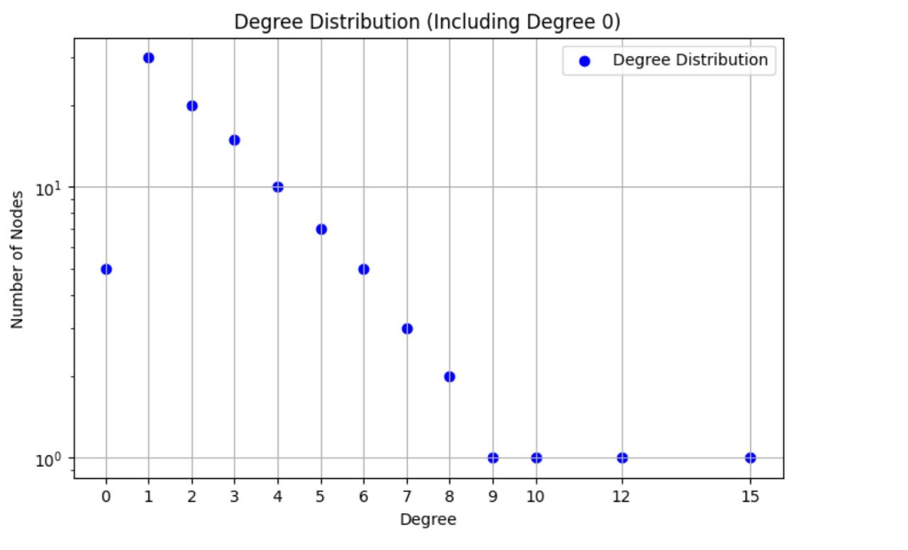

# Gossip Protocol Implementation in P2P Network

## Overview

This project implements a Gossip protocol over a peer-to-peer (P2P) network to broadcast messages and check the liveness of connected peers. The system consists of two main components: Seed Nodes and Peer Nodes.

## Key Concepts

### 1. Seed Node System

- Seed nodes bootstrap new peers into the network.
- New peers connect to ⌊(n/2)⌋ + 1 randomly chosen seed nodes out of n available seeds.
- Seed nodes provide initial peer lists to new peers, helping them discover existing nodes.

### 2. Gossip Protocol

- Peers generate and send gossip messages every 5 seconds, for a total of 10 messages.
- A Message List (ML) is maintained to prevent message flooding and loops in the network.
- Received gossip messages are forwarded to connected peers if they haven't been seen before.

### 3. Liveness Checking

- Peers send liveness requests to connected peers every 13 seconds.
- If three consecutive replies are not received, the peer is reported as dead.
- Dead node information is sent to all connected seed nodes for network maintenance.

### 4. Multithreading

The implementation uses three threads for different tasks:
- Listening for incoming connections
- Performing liveness testing
- Generating and propagating gossip messages

### 5. Power Law Distribution

- Implemented in the peer selection process.
- Peers are sorted based on their degree (number of connections) in descending order.
- The top n/2 peers are selected, where n is the total number of peers in the network.
- This creates a network topology where some nodes have many connections while others have few, thereby ensuring power law distribution.
- On further testing, we noticed an alpha value = 4.8 when we used 4 peer nodes, but increasing the number of peer nodes to over 20 brought the value of alpha to 3. Further increasing the number of nodes brings alpha to be between 2 and 3, thereby proving the power law distribution.

### 6. Degree Management

The implementation maintains and updates the degree (number of connections) for each peer:
- Initial degree: When a peer joins the network, it starts with a degree of 0.
- Degree incrementation: The `increment_degree_on_seeds()` function is called when a new connection is established, increasing the peer's degree on all connected seed nodes.
- Degree updates: The `update_degree_to_seeds()` function informs seed nodes of a peer's current degree after connecting to other peers.
- Dead node handling: When a peer is found to be unresponsive, its degree is decremented on the seed nodes, and the reporting peer's degree is updated accordingly.

## Description of the Code

### SEED

1. Create socket, bind socket, and then listen for requests/messages
2. Once it receives a connect request from a peer, it creates a separate thread
3. If it receives a connection request from a peer, it sends its peer list to that peer
4. If it receives a dead message, it will remove the peer from its peer list

### PEER

1. Read seed addresses from the connect file
2. Send requests to seeds
3. Receive peer list and connect to some random peers
4. Create 3 separate threads: one for listening, another for gossip, and the last one for liveness testing
5. Generate gossip messages, forward them, and generate liveness requests
6. If a peer is down, send a dead node message to the seed node

## Compilation and Execution Steps

1. Open the project folder:
   - Open the file "config.txt" and put the System IP and any Port number in the format of "IP:PORT"
   - Based on the number of seeds, manually add all Seed Addresses in the same format

2. Go to the directory where `seed.py` and `peer.py` files are available using the terminal

### To compile and run seed:

3. Run the code using `python3 seed.py`
4. Based on the number of entries in the config file, run different seeds with different port numbers given in the config file. Enter port number only.
5. Run one or more instances of the terminal using the same steps 3 and 4

### To compile and run peer:

6. Run the code using `python3 peer.py`
7. Give the port number as you wish. Enter distinct port numbers for each peer.
8. Run one or more instances of the terminal using the same steps 6 and 7 to generate more peers.

A sample config file and output files are already provided.
